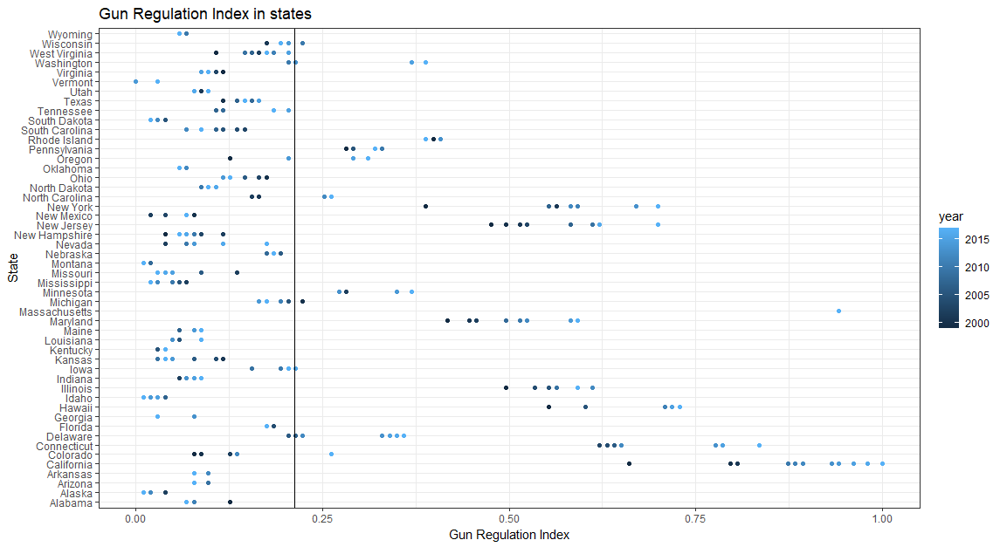

# Gun Deaths and Regulation<!--{{{-->
Work for the Programming lab 1 group project.

This work aims to verify the presence (or lack-there-of) of correlation between gun restrictions and gun deaths in the USA. 

To this aim, we're going to be using two datasets:
- [Gun Deaths (from the US Government)](https://www.kaggle.com/datasets/ahmedeltom/us-gun-deaths-by-county-19992019)
- [Firearms Provisions in US States (Compiled from many sources on Kaggle)](https://www.kaggle.com/datasets/jboysen/state-firearms?select=raw_data.csv)}}}

So far, we've made some plots:
- Descriptive
- Explorative (not yet)

## Descriptive Plots
Descriptive Plots serve the fgunction to help us understand and explain the content of the datasets, and to setup the future analysis

.png)

.png)

## Explorative Plots
Explorative Plots are going to be completed in t he next few days
